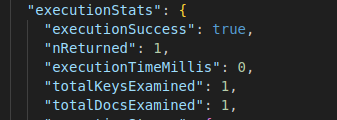
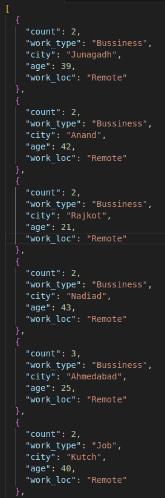

# MongoDB_Assignment

### Creating Database and Collection

```
//The current database to use,if not exists creates new one
use("citizens");

//Create a new collection.
db.createCollection("employed");
```


### Task-1: Batch Create with minimum 100 records in MongoDB

```
// Generating dummy records/documents to insert in the collection
var data = [];
var cities = [
"Nadiad",
"Ahmedabad",
"Anand",
"Noida",
"Pune",
"Chennai",
"Rajkot",
"Junagadh",
"Vadodara",
"Kutch",
];
var work_loc = ["Remote", "Onsite"];
var work_type = ["Bussiness", "Job"];

// A loop to generate dummy records for 116 people
for (let i = 0; i < 116; i++) {
data.push({
name: `Person${i + 1}`,

    // Randomly generates values between 0 to 9 to to map with the cities array
    city: cities[Math.floor(Math.random() * 10)],

    // Generates random age range in 20 to 49
    age: Math.floor(Math.random() * 30) + 20,

    //Gives us value between 0 or 1 to map with the work_loc array
    work_loc: work_loc[Math.floor(Math.random() * 1.5)],

    //Gives us value between 0 or 1 to map with the work_type array
    work_type: work_type[Math.floor(Math.random() * 1.5)],

});
}

//Query to insert records in a single batch
db.employed.insertMany(data);
```


```
//Fetching the data
db.employed.find();
```


### Task-2: Batch Update with minimum 100 records in MongoDB

```
//Increasing the age by 1 year to all records in the collection
db.employed.updateMany(
    {},
    {
        $inc: { age: 1 }
    });
```


### Task-3: Perform indexing on particular 3 fields in MongoDB.

```
// Creating a compound index on 'name', 'city' and 'work_loc'
db.employed.createIndex({ name: 1, city: 1, work_loc: 1 });

```


```
// Searching after creating a compound index on 'name', 'city' and 'work_loc' with explain method
db.employed.find({ name: "Person62",
    city: "Ahmedabad",
    work_loc: "Remote" }
    ).explain("executionStats");
```

Here we can see that totalDocsExamined is 1 after indexing


### Task-4: Find duplicates using aggregation in MongoDB

As the dummy data I created has unique names we won't find duplicates if we
include the name field in aggregation pipeline, thus I have found the duplicates based on the
the rest of the fields.

```

db.employed.aggregate([
  {
    //Grouping stage based on fields except name
    $group: {
      _id: {
        work_type: "$work_type",
        city: "$city",
        age: "$age",
        work_loc: "$work_loc",
      },
      //Counting the number of docs in a group
      count: {
        $sum: 1,
      },
    },
  },
  {
    //Matching stage
    $match: {
      //If a group has count greater than 1 then it has duplicates
      count: {
        $gt: 1,
      },
    },
  },
  {
    //Projection stage to specify which fields to show in final result
    $project: {
      _id: 0,
      count: 1,
      work_type: "$_id.work_type",
      city: "$_id.city",
      age: "$_id.age",
      work_loc: "$_id.work_loc",
    },
  },
]);
```


